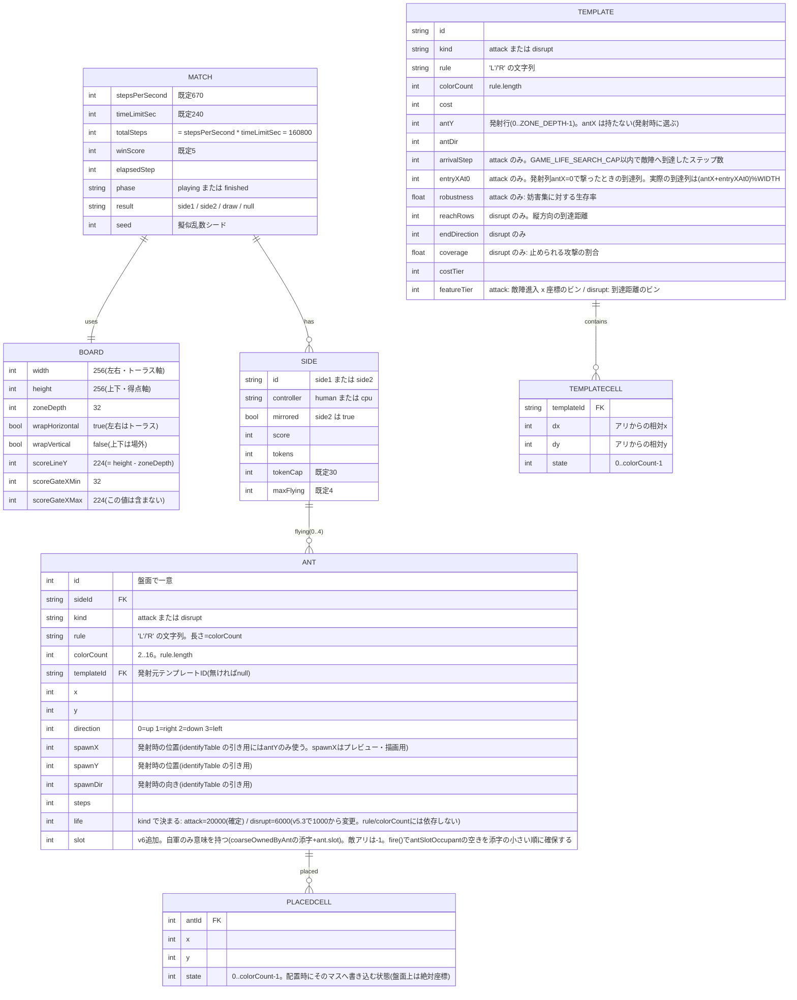

# データモデル

背景は [../README.md](../README.md)、機能・受け入れ条件は [spec.md](spec.md)、全体構成は [architecture.md](architecture.md)。

> v5(盤面拡大版)で盤面が 60×120 → **256×256(正方形)** に拡大し、配置可能帯の深さ(`ZONE_DEPTH`)が
> 16→32、寿命が攻撃3,600→6,000(暫定)・妨害400→1,000になった。**発射列(`antX`)がテンプレートから
> 消え、発射時にプレイヤー/CPU が自由に選ぶ値になった。** これに伴い配置マス(`cells`)は絶対座標では
> なく**アリからの相対座標** `[dx, dy, state]` になり、`identifyTable` のキーも `"antX,antY,antDir"` から
> `"antY,antDir"` に変わった。
>
> v5.1 で `ATTACK_LIFE` が暫定値6,000から**確定値20,000**になり、`STEPS_PER_SECOND` が300→**670**に、
> `TOTAL_STEPS` が72,000→**160,800**になった(`DISRUPT_LIFE`=1,000は据え置き)。数値は必ず
> [`src/config.js`](../src/config.js) の実際の値を参照すること。
>
> v5.2 で方策ベクトルが13 → **16次元**に拡張された。CPU が盤面を見られるようになり、自爆機能が追加された。
>
> v5.3 で妨害アリの寿命が 1,000 → **6,000**に引き上げられ、盤面中央を越えられない空間制約が追加された。
> 発射列が方策で決まるようになり、方策ベクトルが 16 → **18次元**に拡張された。
>
> v5.4 で妨害発射列の照準が事前計算テーブルに戻り、方策ベクトルが18 → **17次元**に縮小された。
> `disruptAimOffsetFrac` を削除し、`selfDestructAgeFrac` を `selfDestructRemainingTicks` に置換した。
>
> v5.5 で**テンプレート数が9+9 → 3+3に削減**され、方策ベクトルが17 → **11次元**に縮小された。
> 妨害の非対称コスト(`2 + ceil(マス/2)`)を導入。`DISRUPT_BASE_COST` に改名(`DISRUPT_COST` 廃止)。
> 最終選抜が役割別(Speed/Economy/Robust × Cheap/General/Complement)に変更。
>
> v6 で **CPU のデータモデルが全面刷新**された。旧11次元の方策ベクトル(`policy` オブジェクト)は廃止され、
> `data/policy.json` は **26要素の `weights` 配列(線形評価器の重み)ひとつ**を唯一の方策として持つ。
> `src/engine.js` に **32×32粗視化盤面**(`coarseNonWhite`/`coarseOwnedBySide`)と**自軍アリ別 ownership map**
> (`coarseOwnedByAnt`/`antSlotOccupant`/`lastToucherSlot`)が増分更新で追加され、Ant に `slot` が加わった。
> CPU の Action は **WAIT / FIRE / SELF_DESTRUCT** の3種のみになった。全スキーマの唯一の正は
> [action-centric-contract.md](action-centric-contract.md)(以下「契約書」)であり、本書はそれと二重管理しない。



| エンティティ | 主なフィールド | 補足 |
|---|---|---|
| Match(試合) | `stepsPerSecond`, `timeLimitSec`, `totalSteps`, `winScore`, `elapsedStep`, `phase`, `result`, `seed` | 先に `winScore` 到達で勝ち。`totalSteps`(=160,800)経過で得点比較、同点なら `draw` |
| Board(盤面) | `width`(256), `height`(256), `zoneDepth`(32), `wrapHorizontal`(true), `wrapVertical`(false), `scoreLineY`(224), `scoreGateXMin`(32), `scoreGateXMax`(224) | side1 の配置可能帯は `y=0..31`、side2 は `y=224..255`。左右はトーラス、上下端でアリ消滅/得点。得点ゲートは下記参照 |
| Side(陣営) | `id`, `controller`, `mirrored`, `score`, `tokens`, `tokenCap`, `maxFlying` | `tokens` は1秒(=670ステップ)ごとに+1(上限30)。アリ飛行中も蓄積。同時飛行は攻撃・妨害あわせて最大4匹 |
| Ant(アリ) | `id`, `sideId`, `kind`, `rule`, `colorCount`, `templateId`, `x`, `y`, `direction`, `spawnX`, `spawnY`, `spawnDir`, `steps`, `life`, `slot`(v6) | 現在位置 `x` / `y` / `direction` は毎ステップ動く。発射位置 `spawnX` / `spawnY` / `spawnDir` は発射時に保存される。`identifyTable` を引くのに使うのは `spawnY`/`spawnDir` の組だけ(`spawnX` は発射時に選べる自由度なので識別には使わない)。`rule` / `colorCount` は発射時に固定され消滅まで変わらない。`kind` で寿命が決まる(attack=20000(確定) / disrupt=6000(v5.3で1,000から変更)。ルールの長さでは変わらない)。`steps >= life` で消滅。**`slot`(v6追加)** は自軍アリ別 ownership map(`coarseOwnedByAnt`)の添字で、`fire()` が `antSlotOccupant[sideIndex]` の空きを添字の小さい順に確保して割り当てる。敵アリの `slot` は常に `-1`。内部実装は `ant.touched`(踏んだマスの添字列)も持つが、これはクリーンアップ専用の実装詳細で試合の外部モデルには出さない(下記「盤面の内部表現」参照) |
| PlacedCell(配置マス) | `antId`, `x`, `y`, `state` | **アリ単位**で持つ(陣営単位ではない)。盤面上は**絶対座標**(発射時に `src/template.js` の `instantiateTemplate` が相対テンプレートを絶対座標へ変換してから書き込む)。そのアリの消滅時にクリーンアップ対象になる。`state` は `0 <= state < colorCount` |
| Template(テンプレート) | `id`, `kind`, `rule`, `colorCount`, `cost`, `antY`, `antDir`, `arrivalStep` / `entryXAt0` / `robustness`(攻撃)、`reachRows` / `endDirection` / `coverage`(妨害), `costTier`, `featureTier` | **`antX` を持たない**(発射列は発射時にプレイヤー/CPUが自由に選ぶ)。攻撃用と妨害用で特徴軸が異なる。`robustness` / `coverage` は共進化生成の結果 |
| TemplateCell | `templateId`, `dx`, `dy`, `state` | 配置マスの**アリからの相対座標**と状態。アリの初期行・向きは Template に `antY` / `antDir` として持つ(`antX` は無い) |

#### Ant の発射位置(`spawnX` / `spawnY` / `spawnDir`)

`identifyTable` で敵の攻撃を識別するにはアリの発射行・向きが必要だが、Ant の現在位置 `x` / `y` / `direction` は毎ステップ移動するため識別に使えない。アリは発射したステップ内で既に1歩進んでいるため、観測できる時点で発射位置とは異なる値になっているためである。

代わりに、発射時に `spawnX` / `spawnY` / `spawnDir` として発射した陣営自身のローカル座標での発射位置を保存する(`src/engine.js` の `fire()`)。**v5 で `identifyTable` のキーは `"antY,antDir"` に変わった**(発射列 `antX` が可変になったため識別キーから外れた)ので、`identifyTable["\${spawnY},\${spawnDir}"]` を引く。`spawnX` は識別には使わないが、UI のプレビュー・敵弾の到達列予測(`entryXAt0` との合算)には使う。

> ⚠️ `src/engine.js` の `fire()` / `createSideView` 周辺のコメントは、本稿執筆時点でもまだ旧仕様のまま `identifyTable("antX,antY,antDir")` と書かれている。**実際に書き出され・引かれるキーは `"antY,antDir"`** であり(`src/search/genome.js` の `identityKey`、`scripts/generate-templates.mjs` の `identifyTable[identityKey(a)] = a.id`)、本書はコードの実際の挙動を優先して記載している。コメントの追随は未対応([spec.md](spec.md) 未決定事項参照)。

## 盤面の内部表現

```js
board           = new Uint8Array(W * H);   // セルの状態。0(白)〜MAX_COLORS-1(15)まで取りうる
lastToucher     = new Int16Array(W * H);   // 最後にそのマスを踏んだアリの id。-1 = 誰も踏んでいない
lastToucherSide = new Uint8Array(W * H);   // 最後にそのマスへ触れた陣営。0=未接触 / 1=side1 / 2=side2
lastToucherSlot = new Uint8Array(W * H);   // v6追加。最後にそのマスへ触れたアリのスロット+1。0=所有者なし
```

セルはオブジェクト化しない。256×256 = 65,536セル。

`lastToucher` は `Int16Array`(最大32,767)。1試合の発射数は最大でも「毎秒+1 × 240秒 ÷ 最小コスト3」= 80発なので、id は溢れない。

`lastToucherSide` は描画専用の追加フィールド(v4)。UI がセルの色相(陣営: 藍/朱)を決めるのに使い、`lastToucher` によるクリーンアップ判定のロジック自体には影響しない。

### 盤面汚染度の計算(v5.2)

CPU が盤面を観測できるようにするため、`createMatch` の内部に増分カウンタを追加:

| カウンタ | 意味 |
|---|---|
| `nonWhiteTotal` | 盤面全体の非白セル数。`boardPollution = nonWhiteTotal / CELL_COUNT` で算出 |
| `nonWhiteZone` | 自分の陣営の配置可能帯(深さ `ZONE_DEPTH`=32)の非白セル数。`myZonePollution = nonWhiteZone / (WIDTH * ZONE_DEPTH)` で算出 |

敵陣の汚染度 `enemyZonePollution` も同じカウンタから算出(敵側の配置帯も32行)。`fire()` / `stepAnt()` / `cleanupAnt()` はセル値が「0 ↔ 0以外」を跨ぐときだけカウンタを更新する(O(1)・性能オーバーヘッド小)。

`createSideView` が CPU に渡す内容(v5.2 以降):
- **派生スカラー**(0..1): `boardPollution`, `myZonePollution`, `enemyZonePollution`
- **参照渡し(読み取り専用)**(`board`: `Uint8Array`[65536], `lastToucherSide`: `Uint8Array`[65536], `columnNonWhite`: `Int32Array`[256])

⚠️ **重要**: view は学習1回で約4,600万回作られるので、(a)コピーを1回でも挟むと学習が終わらない、(b)利用側が毎判断で全65,536セルを走査しても同様に破綻する。「どの列が汚れているか」を知りたいだけなら **`columnNonWhite` を使うこと**。参照渡しなので読み取り専用として扱う。engine 側は `createMatch` が `nonWhiteColumn`(長さ WIDTH の `Int32Array`)を持ち、`fire()` / `stepAnt()` / `cleanupAnt()` がセル値の「0 ↔ 0以外」の跨ぎだけで増分更新する。

> ⚠️ **v6 での位置づけ**: `boardPollution` / `myZonePollution` / `enemyZonePollution` / `columnNonWhite` は `src/engine.js` の `createSideView` から**引き続き公開されている**(削除していない)が、v6 の `src/cpu.js`(26次元 Action 評価器)はこれらを**一切参照しない**。現在これらを読むのは `src/cpu-legacy.js`(凍結した v5.5 の旧CPU。`scripts/evaluate-policy.mjs --mode final` が対戦相手として使う)だけである。v6 の盤面認識は次の「32×32粗視化盤面とownershipマップ」に置き換わった。

### 32×32粗視化盤面とownershipマップ(v6)

CPU(機能6)が256×256の実盤面を毎判断走査すると学習が終わらないため、8×8セルを1ブロックに畳んだ **32×32の粗視化盤面**を `createMatch` の戻り値に増分更新で持つ。**唯一の実装契約は [action-centric-contract.md](action-centric-contract.md) §1**。ここでは配列の型・添字の求め方・不変条件だけをまとめる。

```js
// すべてグローバル coarse 座標(index = cyGlobal * 32 + cxGlobal)
coarseNonWhite:    new Int32Array(1024),               // ブロック内の非白セル数 0..64
coarseOwnedBySide: [new Int32Array(1024),               // lastToucherSide===1 のセル数(side0)
                    new Int32Array(1024)],              // lastToucherSide===2 のセル数(side1)
// 自軍アリ別 ownership。[sideIndex][slot] で 32×32。slot は 0..MAX_FLYING-1
coarseOwnedByAnt: [
  Array.from({length: 4}, () => new Int32Array(1024)),  // MAX_FLYING=4
  Array.from({length: 4}, () => new Int32Array(1024)),
],
antSlotOccupant: [new Int8Array(4).fill(-1), new Int8Array(4).fill(-1)], // 各スロットのantId。空き=-1
```

`x >> COARSE_SHIFT`(=3)・`gy >> COARSE_SHIFT` で coarse 座標を求める(`WIDTH=256` が `COARSE_SIZE=32` の倍数である前提)。CPUローカル座標への変換は `C.coarseLocalRow(sideIndex, cyGlobal)`(`y` だけを鏡像にする。`x` は共有トーラス軸なので変換しない)。

**増分更新の経路は `stepAnt` / `fire` / `cleanupAnt` の3つだけ**(既存の `bumpCounters` 呼び出し箇所と完全に同じ)。新しい書き込み経路を作らない。

| 経路 | 意味 |
|---|---|
| `stepAnt` | アリが1マス進んで踏んだセルの所有者が変わる |
| `fire`(配置マス) | 配置マスの書き込みも ownership に計上する。⚠️ **落としやすい**: `fire()` も `lastToucher[j] = antId` を書くため、ここを見落とすと「`ownedTrailAmount` が実 cleanup セル数と一致する」という不変条件が壊れる(契約書 §1.2) |
| `cleanupAnt`(白に戻すセル) | 所有者を「なし」(`side=0`/`slot=0`)に戻す |

**スロットの確保と解放**: `fire()` は `antSlotOccupant[sideIndex]` の空き(値-1)を**添字の小さい順**に探して確保し、`ant.slot` に持たせる。空きが無いことは `canFire` が `MAX_FLYING` を弾くので起こらない。アリの消滅時は `cleanupAnt` の後に `antSlotOccupant[side][slot] = -1` と `coarseOwnedByAnt[side][slot].fill(0)` を行う(後者は cleanup が正しければ冗長だが、不変条件の保険として必ず行う)。

**不変条件**(テストで検査する対象。§1.3): `Σ_slot coarseOwnedByAnt[s][slot][b]` は「ブロック `b` 内で `lastToucher[j] !== -1` かつ `lastToucherSide[j] === s+1` のセル数」= `coarseOwnedBySide[s][b]` に一致する。

`createSideView` はこれらを**参照渡し・グローバル coarse 座標のまま**公開する(コピーしない。既存 `board`/`columnNonWhite` と同じ規律):

```js
coarseNonWhite,   // Int32Array(1024) 参照
coarseOwnedMine,  // Int32Array(1024) = match.coarseOwnedBySide[sideIndex]
coarseOwnedEnemy, // Int32Array(1024) = match.coarseOwnedBySide[1-sideIndex]
coarseAntOwned,   // (Int32Array|null)[MAX_FLYING]。自軍スロットごと。空きスロットはnull
```

`toView(ant)` にも `slot`(自軍のみ意味を持つ。敵アリは`-1`)が追加された。

### `ant.touched` によるクリーンアップの高速化(v5)

盤面が 7,200 → 65,536 マスになったため、アリ消滅時の「`lastToucher` が自分と一致する全マスを探す」処理を**全盤面走査**のまま残すと、1試合あたり数十匹の消滅がボトルネックになる(5,000試合のバランス検証が現実的な時間で終わらない)。`src/engine.js` の `stepAnt` はアリが移動のたびに踏んだマスの添字を `ant.touched` 配列へ記録し、`cleanupAnt` は全盤面ではなく `ant.touched` だけを走査する。`lastToucher[q] === ant.id` になりうるマスは「そのアリが実際に踏んだマス」の部分集合でしかありえないため、この置き換えは**全盤面走査と同値**(`test/engine.test.js` に回帰テストあり: 消滅後に盤面全体を走査してそのアリの `lastToucher` が1マスも残らないことを確認する)。

### オフライン用シミュレーション盤面の使い回し(v5)

`simulateSolo` / `simulateVersus`(`src/engine.js`)、`simulateWithBoard`(`src/search/highway-fingerprint.js`)はいずれも、呼び出しのたびに `Uint8Array`/`Int16Array` を新規確保せず、**モジュールレベルのバッファを使い回す**。盤面が65,536マスになり、MAP-Elites の探索(数百万回)やカウンター行列の計算(数十万回)のたびに確保・`fill(-1)` していると、それだけで探索が破綻する見積もりになるため。触れたマスの添字だけを実行の最後に白紙へ戻すことでこれを避けている。

> ⚠️ **再入不可**。同じバッファ集合を使う関数の実行中に、同じ関数を再帰的・並行に呼び出してはいけない。`simulateSolo` と `simulateVersus` は別のバッファ集合を持つので、片方の中からもう片方を呼ぶのは安全。並列化は `worker_threads`(ワーカーごとにモジュールインスタンスが独立)で行う(下記「探索の並列化」参照)。

### 異種ルールの衝突(共通ルール)

グローバル固定の `RULE` は廃止された。各アリは自分の `rule`(`'L'/'R'` の文字列)と `colorCount`(= `rule.length`, 2〜16)を持ち、盤面の生値(0..15)を**自分の色数で割った余り**として解釈する。回転は「踏んだ時点の状態」で決める(状態を進めた後の値ではない)。

```js
// src/engine.js の stepAnt() より
const s = board[j] % ant.colorCount;
ant.dir = ant.rule[s] === 'R' ? (ant.dir + 1) & 3 : (ant.dir + 3) & 3;
board[j] = (s + 1) % ant.colorCount;
```

例: 16色アリが残した状態13のセルに3色アリが入ると `13 % 3 = 1` として解釈し、そのアリの規則に従って `(1 + 1) % 3 = 2` に書き換える。**この状態空間の圧縮自体を、異なる弾どうしのゲーム上の干渉として扱う**という設計判断であり、バグではない。

### 発射時の書き込み(発射列 antX の実体化)

**v5 で `template.cells` は絶対座標ではなく、アリからの相対座標 `[dx, dy, state]` になった。** 発射時に `src/template.js` の `instantiateTemplate(template, antX)` を通し、絶対座標の `action`(`cells: [[x,y,state], ...]`)へ変換してから盤面に書き込む。

```js
// src/template.js の instantiateTemplate() より(要旨)
function instantiateTemplate(template, antX) {
  const ax = wrap(antX ?? template.antX ?? 0);   // 0..WIDTH-1 に正規化
  const cells = template.cells.map(([dx, dy, state]) => [wrap(ax + dx), template.antY + dy, state]);
  return { ...template, antX: ax, cells };
}
```

```js
// engine.js の fire() より(action は上で絶対座標化済み)
for (const cell of action.cells) {
  const [x, y] = cell;
  const j = idx(x, toGlobalY(sideIndex, y)); // x は変換しない(左右は共有トーラス軸)。y だけ陣営ごとに鏡像
  board[j] = cellState(cell);       // ← セルごとに指定された状態で上書き。既存の非白セルにも無条件上書き
  lastToucher[j] = antId;           // ← -1 ではなく自分の id で埋める
  lastToucherSide[j] = sideIndex + 1;
}
```

`TemplateCell` は `[dx, dy, state]` の3要素(アリからの相対)。`state` は `0 <= state < rule.length` を満たす必要がある。`src/engine.js` は互換のため、2要素の `[dx, dy]` も引き続き `state = 1` として受け付ける。

**なぜ `antX` が自由に選べるか**: 左右がトーラスなので、x方向の平行移動は力学の厳密な対称性である。同じテンプレートをどの列から撃っても軌道は平行移動するだけで、周期・並進・形成ステップは変わらない。一方 `antY` はテンプレート固有のまま変更できない(y方向の平行移動は得点ラインまでの距離を変え、寿命内に届くかどうかに影響するため)。

### クリーンアップ

アリ `a` が消滅したとき、白(状態0)に戻すのは次の集合(挙動は v3 から不変。走査方法だけ v5 で変わった。上の「`ant.touched` によるクリーンアップの高速化」参照)。

```
{ a.placedCells のうち lastToucher[i] が -1 または a.id のもの }
∪ { lastToucher[i] === a.id であるすべてのマス }
```

`lastToucher` を見ることで、**他のアリが後から踏んだマスは残す**。複数アリが干渉する試合では、単純な一括クリアだと他のアリの軌跡を壊してしまうため必須。クリーンアップ時は `lastToucherSide` も同時にリセットする。

> v2 の `Ant.flippedCells`(アリ側が集合を持つ方式)は廃止した。他のアリが上書きしたかどうかを判定できないため。

## 座標系

エンジンは **side1 のローカル座標**で動く。x(左右)は両陣営で共有するトーラス軸なので変換しない。y(上下)だけが陣営ごとに鏡像になる: `yGlobal = HEIGHT - 1 - yLocal`(= `255 - yLocal`。`src/engine.js` の `toGlobalY` / `toLocalY`。自己逆変換なので式は同じ)。向きは **up ⇄ down** を入れ替える(`mirrorDir`)。left / right はそのまま。`Side.mirrored` でどちらかを保持する。

## 得点ゲート

x が `[SCORE_GATE_X_MIN, SCORE_GATE_X_MAX)` = `[32, 224)` の範囲かどうかを `src/config.js` の `isInScoreGate(x)` で判定する。engine の得点判定(`resolveAnt`)と UI の描画がこの1つの定義を共有する。x はグローバル座標のまま両陣営で共通に判定できる(x は陣営間で鏡像にならない。鏡像になるのは y だけ)。詳細な設計判断は [spec.md](spec.md) の「得点ゲート」を参照。

## 探索(MAP-Elites)の型

`src/search/genome.js` / `src/search/mutate.js` / `src/search/map-elites.js` が、テンプレート生成の元になる探索空間の型を定義する。いずれも `src/engine.js` を import しない純粋なデータ操作(オフライン生成専用)。

### Genome

```js
genome = {
  rule: 'LRLR...',       // 'L'/'R' のみからなる**原始形**の文字列。長さ = colorCount(2..16)
  antY: 0,                // 配置帯(0<=antY<ZONE_DEPTH)内のアリの初期行
  antDir: 0,              // 0|1|2|3
  cells: [{ dx, dy, state }, ...], // 1..MAX_CELLS(16)個。**アリからの相対座標**。座標は重複しない
  origin: 'random',       // 'random' | 'mutation' | 'distilled'(探索アーカイブの分析用。任意)
  parentGenomeId: null,   // distilled の親を辿るためのID(任意)
};
```

⚠️ **v5 の変更点: genome は `antX`(発射列)を持たない。** 左右がトーラスなので x方向の平行移動は力学の厳密な対称性であり、発射列は発射時にプレイヤー/CPUが選ぶ自由度になった(詳細は [spec.md](spec.md) 「発射列(antX)の可変化」)。これに伴い `cells` は絶対 x ではなく**アリ列からの相対 `dx`** で持つ。`dy` も同様にアリ行からの相対にしてある(Seed Distillation が生成する種が「アリ周囲の局所セル」なので、表現をそちらに合わせると変換が要らない)。

不変条件(`validateGenome` が検査する。**エンジンの `canFire`/`fire` はこれを検査しない**、探索専用のチェックであることに注意):

- `rule.length` は 2..16、`'L'/'R'` のみで構成され、かつ**原始形(primitive root)である**こと(`LLRLLR` のように短い繰り返しになっているルールは不正。`canonicalRule` で正規化してから使う)
- `antX` フィールドが存在してはいけない(genome は発射列を持たない。混入していたら設計上のバグ)
- `cells.length` は 1..16(`MIN_TEMPLATE_CELLS`..`MAX_CELLS`)。座標 `(dx,dy)` は重複禁止
- 各セルの `dx`/`dy` は **アリ近傍(チェビシェフ半径 `TEMPLATE_CELL_RADIUS`=8)の内側**、かつ `antY + dy` が配置帯(`0<=y<ZONE_DEPTH`)に収まること
- 各セルの `state` は `0 <= state < rule.length`
- `antY` は配置帯の内側、`antDir` は 0..3

`genome.js` はほかに `createRandomGenome(rng)`(不変条件を満たすランダム生成。セルはアリ近傍にのみ撒く)、`cloneGenome`(深いコピー)、`genomeKey`(重複検出用の決定論的文字列キー)、`identityKey(g)`(= `` `${g.antY},${g.antDir}` ``。`identifyTable` のキー生成に使う)、`toTemplateCells(g)`(`cells` を `templates.json` 用の `[dx,dy,state]` 3要素配列へ変換)、`costOfGenome(g, baseCost)`(= `baseCost + cells.length`。ルール長にはコストを課さない)、`canonicalRule(rule)`(ルール文字列を最小の繰り返し単位に還元する)を提供する。

`mutate.js` の `mutate(genome, rng)` は `MUTATION_COUNT_WEIGHTS`(`[0.7, 0.2, 0.1]` = 1回/2回/3回)に従って変異を連鎖適用する。オペレータは `bitFlip`(rule の1文字反転。結果を原始形に正規化)、`ruleInsert`/`ruleDelete`(rule の伸縮。長さ変更後は全セルの `state` を新しい `colorCount` で剰余に丸める)、`cellAdd`/`cellDelete`/`cellMove`/`cellState`(いずれもアリ近傍半径・配置帯の両方でクランプ/reject)、`antYPlus`/`antYMinus`(アリの行を動かす。配置マスも一緒に動くので、動かした先で配置帯からはみ出すセルがあれば reject)/`antDir`。**v5 で `antX` 系のオペレータは削除された**(genome が `antX` を持たなくなったため)。`rule.length` が境界(`MIN_COLORS`/`MAX_COLORS`)や `cells.length` が境界(`MIN_TEMPLATE_CELLS`/`MAX_CELLS`)にあるときは、その方向の伸縮オペレータを候補から外す。

### MAP-Elites アーカイブ(汎用実装)

`map-elites.js` の `createArchive({ dims })` は `dims: [{ name, bins }, ...]` を受け取り、内部表現は疎な `Map`(キーは各次元のビン値を連結した文字列)を持つ。`tryInsert(archive, { genome, descriptor, quality, meta })` は空セルなら常に挿入、埋まっているセルは `quality` が厳密に大きいときだけ置換する。`runMapElites({ archive, evaluate, rng, iterations, initialBatch, onProgress })` が「初期バッチをランダム生成 → 反復ごとに親をサンプリングして変異・評価・挿入」というループ本体。`evaluate` が `descriptor` を返さない個体は挿入せずスキップする。`archiveStats`/`archiveEntries`/`toJSON`/`fromJSON` で統計取得・列挙・シリアライズができる。

> `scripts/generate-templates.mjs` は `createArchive`/`tryInsert`/`sampleParent`/`archiveEntries`/`archiveStats`/`toJSON` を実際に呼び出す(v5 で配線済み。旧版は未配線だったが解消した)。ただし `runMapElites` 自体は使わず、`worker_threads` によるバッチ並列評価のため独自のループ(初期バッチ生成 → ワーカーへ一括投入 → 添字順に挿入、を繰り返す)を書いている。

`src/config.js` に定義されている記述子ビン(実際に `scripts/generate-templates.mjs` が使っている値):

| アーカイブ(用途) | 次元 | 実際の値(`src/config.js`) |
|---|---|---|
| 第1アーカイブ(ハイウェイ発見) | `direction` | `ARCHIVE1.directions` = 8方向(`N,NE,E,SE,S,SW,W,NW`) |
| | `speedBin` | `ARCHIVE1.speedBins` = 10(0.0..1.0 を10等分) |
| | `formationBin` | `ARCHIVE1.formationBins` = `[64,128,256,512,1024,2048,4096,SEARCH_LIFE(30000)]` の8段階(対数的な区切り) |
| | `cost` | `MAX_CELLS + ATTACK_COST + 1` = 22 段階(v5 で追加。コスト値をそのままビン番号として使う) |
| 第2アーカイブ(攻撃) | `entryPositionTier` | `ARCHIVE2.entryPositionBins` = 6(敵陣へ侵入した **x座標**を `WIDTH/6` 幅で等分するビン) |
| | `robustnessTier` | `ARCHIVE2.robustnessBins` = `[0.5, 1.0]` |
| | `speedClassTier` | `ARCHIVE2.speedClassBins` = `[0.025, 0.040, 1.0]`(ハイウェイ署名から実効的な縦方向速度 `v_y = |driftY| / period` を出し、境界値でビン分けする3段階。v5.1で `ATTACK_LIFE`=20,000確定に伴い到達可能な下限0.0097〜上限0.0556をほぼ3等分する位置に更新) |
| 第2アーカイブ(妨害) | `reachTier` | `ARCHIVE2.reachBins` = 6(縦方向の到達距離 `reachRows` を `ARCHIVE2.reachScale/6` 幅で等分するビン) |
| | `endDirTier` | `C.DIRS.length` = 4(妨害が寿命を使い切った時点の向き) |

> ⚠️ 妨害アーカイブの次元名は攻撃アーカイブと異なる独立した2軸(`reachTier`×`endDirTier`)であり、`ARCHIVE2` オブジェクトの `reachBins`/`reachScale` フィールドを間借りしている(独立した第3のアーカイブ設定オブジェクトが無い)。

`ARCHIVE1_QUALITY`(`stability`/`verticality`/`usability`/`formationPenalty`、いずれも重み1.0)は quality(挿入時の優劣比較に使うスカラー)の配分であり、記述子の次元ではない。計算式は `src/search/evaluate-projectile.js` の `evaluateProjectile` を参照。

### ハイウェイ検出(2段構え。v5 で正式に2ファイルへ分割)

判定は2段構え([spec.md](spec.md) 「ハイウェイ検出の2段構え」の決定に基づく。**軌跡の周期性はハイウェイの十分条件ではない**——位置と向きが周期的でも、周囲のセル状態が同じ構造を再生産しているとは限らないため):

1. **高速フィルタ = `src/search/highway-trajectory.js` の `detectHighwayFromPath(path, options)`**: 軌跡(位置+向き)だけを見る安価な周期性検出。`{ period, driftX, driftY, formationStep, verifiedCycles, speed }` を返す(見つからなければ `null`)。MAP-Elites が数百万 genome を評価するため、全候補にこれだけを適用する。同ファイルの `directionBin(driftX, driftY)` が並進を8方向(`ARCHIVE1.directions`)に離散化する。
2. **厳密確認 = `src/search/highway-fingerprint.js` の `verifyHighwayStrict(genome, candidate, options)`**: アリ座標を原点とした近傍セルの正規化 fingerprint が、確認済み窓のさらに先で `HIGHWAY_MIN_CYCLES` 周期分一致することを、盤面込みで再シミュレーションして確認する高コストな検証。`true`/`false` を返す。高速フィルタで採用された候補にだけ適用する。この検証専用に engine.js の CA 1ステップ処理(`stepAnt` 相当)を最小限だけ複製している(`simulateWithBoard`。意図的な例外。それ以外の場所は必ず `engine.js` の関数を使う)。

**`src/search/highway-detector.js` は上記2モジュールを再エクスポートするだけのファサード**であり、既存の import 元(`test/highway-detector.test.js`、`src/search/evaluate-projectile.js`)を壊さないために残っている。実体は無い。

`src/search/evaluate-projectile.js` の `evaluateProjectile(genome, options)` がこの2段を `highway` オブジェクトの2つの boolean フィールドに落とし込む:

```ts
highway: {
  trajectoryPeriodic: boolean,   // detectHighwayFromPath(高速フィルタ)を通ったか
  fingerprintVerified: boolean,  // verifyHighwayStrict(厳密確認)を通ったか。
                                  // 既定では実行しない(常に false)。options.strict===true
                                  // のときだけ verifyHighwayStrict を実行して埋める
  period: number | null,
  driftX: number | null,
  driftY: number | null,
  verifiedCycles: number | null,
  formationStep: number | null,
  speed: number | null,
}
```

**使い分けは固定**(混同すると高速フィルタの近似が最終選抜まで素通りしてしまう):

| 場面 | 使う値 |
|---|---|
| MAP-Elites 探索中(`scripts/generate-templates.mjs` のアーカイブ挿入・記述子計算・quality) | `trajectoryPeriodic` |
| 最終テンプレート選抜(9×9、`scripts/generate-templates.mjs` の候補プールから 9×9 を選ぶ直前のゲート) | `fingerprintVerified`(`evaluateProjectile(genome, {strict:true})` で再評価してから絞り込む) |

`src/config.js` の `HIGHWAY_MIN_CYCLES`(5)・`HIGHWAY_MAX_PERIOD`(2000)は `detectHighwayFromPath`/`verifyHighwayStrict` の既定パラメータとして実際に参照されている。

`evaluateProjectile` はさらに `game`(実ゲーム条件での評価)を返す:

```ts
game: {
  reached: boolean,       // 敵陣(SCORE_LINE_Y以上)に到達したか(得点ゲートは見ない)
  arrivalStep: number|null, // 到達したステップ数。GAME_LIFE_SEARCH_CAP(=ATTACK_LIFEに連動。現在20,000)を寿命として評価する
  steps: number,
  entryXAt0: number|null, // antX=0で撃ったときの到達列。実プレイの到達列は (antX+entryXAt0) mod WIDTH
  endY: number,
}
```

`viable`(genome がゲーム候補として成立するか)の判定は `highway.trajectoryPeriodic && game.reached && game.arrivalStep <= attackLife && cells.length >= MIN_TEMPLATE_CELLS`。⚠️ **別の寿命へ再判定するときは、保存済みの `arrivalStep` に閾値を当て直すだけでは足りない。** `arrivalStep` は当時の `GAME_LIFE_SEARCH_CAP` までしか記録されておらず、キャップの外で到達した個体は「未到達」として保存されている(実測: 6,000→20,000 で311件の判定漏れ)。正しくは genome を**再評価**する。`scripts/generate-templates.mjs --resume-archive` がこれを行い、段階①(数時間)を飛ばして数秒で済ませる。これが `ATTACK_LIFE` を「本探索の後から決める」ことを可能にしている構造。

### Seed Distillation(v5 で追加)

`src/search/seed-distillation.js` / `src/search/seed-compression.js`。目的は「発見しやすいが形成が遅いハイウェイ」から「ゲームで即座に使える初期配置」を逆抽出すること。

パイプライン(`distillSeed(genome, highway, options)`):

1. **formation snapshot**(`captureFormationSnapshot`): ハイウェイ形成直後(`formationStep` + 周期の整数倍。候補は `[0,1,2,4]` 周期後)の局所盤面をアリ位置基準で切り出す。crop 半径は `[2,3,4,6,8,12,16]` を段階的に試す
2. **replay 検証**(`replaySeed`): 切り出した種セルだけから走らせ直し、元のハイウェイと同じ `period`/`driftX`/`driftY` を `HIGHWAY_MIN_CYCLES` 周期以上再現するか確認する。再現しなければその crop 半径・snapshot 位置を棄却する
3. **セル圧縮**(`compressSeed`): 再現できた種を、アリから遠い順に貪欲削除する。削除後も replay 検証が通る場合だけ確定する(同距離のセルは `(dx,dy)` の辞書順で決定論的に処理する。乱数は使わない)
4. **ゲーム採用可否**(`gameUsability`): 圧縮後のセル集合が `cells.length <= MAX_CELLS`・`|dx|,|dy| <= TEMPLATE_CELL_RADIUS`・dy の広がりが `ZONE_DEPTH` に収まる `antY` が存在すること、を満たせば `gameUsable: true` として `antY`(最も深い位置)を決める

戻り値の形:

```ts
{
  attempted: boolean, success: boolean, gameUsable: boolean,
  genome: Genome | null,          // gameUsable のときだけ非null。origin:'distilled'
  cropRadius: number | null, snapshotStep: number | null,
  sourceFormationStep: number, distilledFormationStep: number | null,
  sourceCellCount: number, distilledCellCount: number | null,
  reason: string | null,
}
```

蒸留 genome は**特別扱いせず**、通常の個体として同じ第1アーカイブへ再投入する(`scripts/generate-templates.mjs`)。

### data/search-report.json(v5で追加)

`src/search/search-report.js` の `buildSearchReport(individuals, options)` が組み立てる、探索結果の統計レポート。ファイル形式:

```json
{
  "generatedAt": "2026-08-08T00:00:00.000Z",
  "seed": 1,
  "sampledRecords": 120000,
  "sampleStride": 8,
  "report": {
    "totalEvaluations": 5000000,
    "trajectoryPeriodicCount": 812345,
    "fingerprintVerifiedCount": 210,
    "highwayVectorHistogram": { "1,1": 302011, "2,2": 88012 },
    "slopeHistogram": { "vertical": 0, "nearVertical": 1200, "shallow": 30211, "steep": 5011, "diagonal": 775923, "lateral": 0 },
    "ruleLengthBySlope": { "diagonal": { "median": 3, "min": 2, "max": 16, "count": 775923 } },
    "periodBySlope": { "...": "同形式" },
    "formationBySlope": { "...": "同形式" },
    "gameViabilityBySlope": { "diagonal": { "viable": 4211, "total": 775923, "rate": 0.0054 } },
    "distillationAttemptCount": 40211,
    "distillationSuccessCount": 12044,
    "distillationSuccessRate": 0.2996,
    "medianOriginalFormationStep": 412,
    "medianDistilledFormationStep": 6,
    "medianFormationReduction": 402,
    "medianOriginalCellCount": 220,
    "medianDistilledCellCount": 9,
    "gameViableBeforeDistillation": 4211,
    "gameViableAfterDistillation": 5893,
    "distillationViabilityGain": 1682
  }
}
```

`SLOPE_BINS`(= `['vertical','nearVertical','shallow','steep','diagonal','lateral']`)は並進 `(driftX, driftY)` を傾き比 `|dx|/|dy|` で分類したビン(`slopeBinOf`)。`sampledRecords`/`sampleStride` は数千万件を保持できないための系統サンプリング(`createReportSampler`。上限に達したら stride を2倍にして間引く)の記録。`formatSearchReport(report)` が同じ内容を日本語のテキストへ整形する(`console.error` に出す用。ファイルには出さない)。

> ⚠️ 上のJSONは**形式を示す例**であり実在の生成結果ではない。

### data/search-archive.json

MAP-Elites 探索アーカイブのデバッグ・再現性確保用ダンプ。`scripts/generate-templates.mjs` の `main()` が実際に書き出す(v5 で配線済み。旧版は未生成だったが解消した)。ファイル形式:

```json
{
  "seed": 1,
  "quick": false,
  "workers": 6,
  "budgetMin": 180,
  "rounds": 4,
  "evaluations": 5000000,
  "generatedAt": "2026-08-08T00:00:00.000Z",
  "selectionOk": true,
  "distillStats": { "attempted": 40211, "success": 12044, "gameUsable": 9012, "reinserted": 8877 },
  "archive1": { "dims": [ { "name": "direction", "bins": 8 } ], "cells": [ ["key", { "genome": {}, "descriptor": {}, "quality": 1.2, "meta": {} }] ] },
  "archive2Attack": { "dims": "...", "cells": "..." },
  "archive2Disrupt": { "dims": "...", "cells": "..." }
}
```

各 `cells` の要素は `[key, individual]` で、`individual = { genome, descriptor, quality, meta }`。`archive1` の `meta` は `{ highway, game, viable, distillation }` の形(`meta.game.arrivalStep` が `scripts/tune-attack-life.mjs` の掃引対象。**この形は tune-attack-life.mjs が直接読むので変更する場合は両方直すこと**)。**ブラウザのゲームはこのファイルを読み込まない**(実行時が読むのは `data/templates.json` と `data/policy.json` のみ)。

> ⚠️ 上のJSONは**形式を示す例**であり実在の生成結果ではない。

## data/templates.json

```json
{
  "generatedAt": "2026-08-08T00:00:00.000Z",
  "schemaVersion": 5,
  "config": {
    "width": 256, "height": 256, "zoneDepth": 32,
    "scoreGateXMin": 32, "scoreGateXMax": 224,
    "minColors": 2, "maxColors": 16,
    "searchLife": 30000, "gameProjectileLife": 20000,
    "attackCost": 5, "attackLife": 20000,
    "disruptBaseCost": 2, "disruptLife": 6000,
    "maxCells": 16, "templateCellRadius": 8
  },
  "attack": [
    {
      "id": "A1",
      "kind": "attack",
      "role": "speed",
      "rule": "RLLRRLR",
      "colorCount": 7,
      "cells": [[-2, 4, 3], [-1, 4, 6]],
      "antY": 5, "antDir": 2,
      "cost": 8,
      "arrivalStep": 5312,
      "entryXAt0": 173,
      "robustness": 0.990,
      "costTier": 8,
      "featureTier": 3,
      "highway": { "trajectoryPeriodic": true, "fingerprintVerified": true, "formationStep": 418, "period": 26, "driftX": 0, "driftY": 2, "speed": 0.076923, "verifiedCycles": 5 }
    },
    {
      "id": "A2",
      "kind": "attack",
      "role": "economy",
      "rule": "RRL",
      "colorCount": 3,
      "cells": [[0, 3, 1]],
      "antY": 4, "antDir": 1,
      "cost": 6,
      "arrivalStep": 4200,
      "entryXAt0": 128,
      "robustness": 0.850,
      "costTier": 6,
      "featureTier": 2,
      "highway": { "trajectoryPeriodic": true, "fingerprintVerified": true, "formationStep": 38, "period": 18, "driftX": 1, "driftY": 1, "speed": 0.056, "verifiedCycles": 5 }
    },
    {
      "id": "A3",
      "kind": "attack",
      "role": "robust",
      "rule": "RRRLLL",
      "colorCount": 6,
      "cells": [[1, 2, 2], [2, 1, 4]],
      "antY": 6, "antDir": 0,
      "cost": 9,
      "arrivalStep": 6800,
      "entryXAt0": 64,
      "robustness": 0.980,
      "costTier": 9,
      "featureTier": 1,
      "highway": { "trajectoryPeriodic": true, "fingerprintVerified": true, "formationStep": 102, "period": 52, "driftX": 1, "driftY": 2, "speed": 0.038, "verifiedCycles": 5 }
    }
  ],
  "disrupt": [
    {
      "id": "D1",
      "kind": "disrupt",
      "role": "cheap",
      "rule": "RL",
      "colorCount": 2,
      "cells": [[1, 8, 1]],
      "antY": 9, "antDir": 3,
      "cost": 3,
      "reachRows": 32,
      "endDirection": 2,
      "coverage": 0.33,
      "costTier": 3,
      "featureTier": 2
    },
    {
      "id": "D2",
      "kind": "disrupt",
      "role": "general",
      "rule": "RLLR",
      "colorCount": 4,
      "cells": [[1, 10, 1], [1, 11, 2]],
      "antY": 11, "antDir": 1,
      "cost": 5,
      "reachRows": 48,
      "endDirection": 1,
      "coverage": 0.67,
      "costTier": 5,
      "featureTier": 3
    },
    {
      "id": "D3",
      "kind": "disrupt",
      "role": "complement",
      "rule": "RRLLLL",
      "colorCount": 6,
      "cells": [[0, 7, 2], [1, 6, 4]],
      "antY": 10, "antDir": 2,
      "cost": 7,
      "reachRows": 56,
      "endDirection": 0,
      "coverage": 0.50,
      "costTier": 7,
      "featureTier": 1
    }
  ],
  "identifyTable": { "5,2": "A1", "4,1": "A2", "6,0": "A3" },
  "counterTable": {
    "A1": [ { "disruptId": "D2", "deltaX": 12, "fireAtStep": 750, "successRate": 0.30 }, { "disruptId": "D3", "deltaX": 8, "fireAtStep": 1200, "successRate": 0.45 } ],
    "A2": [ { "disruptId": "D1", "deltaX": 16, "fireAtStep": 500, "successRate": 0.25 } ],
    "A3": [ { "disruptId": "D2", "deltaX": 20, "fireAtStep": 900, "successRate": 0.55 } ]
  },
  "escortTable": {
    "A1": { "D2": [ { "interceptDeltaX": 12, "interceptFireAtStep": 750, "escortDisruptId": "D1", "escortDeltaX": 4, "fireAtStep": 300 } ] },
    "A2": { "D1": [ { "interceptDeltaX": 16, "interceptFireAtStep": 500, "escortDisruptId": "D2", "escortDeltaX": 6, "fireAtStep": 200 } ] },
    "A3": { "D2": [ { "interceptDeltaX": 20, "interceptFireAtStep": 900, "escortDisruptId": "D3", "escortDeltaX": 10, "fireAtStep": 400 } ] }
  }
}
```

座標(`cells`)はすべて**アリからの相対座標**、`antY`/`antDir` は **side1 ローカル座標**。`antX` はテンプレートに存在しない(発射時にプレイヤー/CPUが選ぶ)。side2 が使うときは `antY`/`cells[].dy` にミラーリング変換をかける。

> `gameProjectileLife` は `attackLife` と同じ値のエイリアス(探索(ハイウェイ発見用の `searchLife`)とゲーム内寿命(`gameProjectileLife`=`attackLife`)を区別するために2つの名前を持つ想定)。
>
> ⚠️ 上のJSONは**形式を示す例**であり実在の生成結果ではない。値の整合は生成スクリプトが保証する。本稿執筆時点でリポジトリにコミットされている `data/templates.json` は**旧スキーマ(v3.1、`config.width=120`等)のまま**であり、テンプレート再生成([architecture.md](architecture.md))を待つ状態にある。参照コードとして見るべきは `scripts/generate-templates.mjs` の `templatesOutput` 組み立て箇所である。

`robustness`(攻撃) = 「同梱の妨害テンプレート集 × 全deltaX × 全発射タイミング」の総当たりのうち、**止められなかった割合**(= `1 - counterDensity`)。1.0 に近いほど強い。生成時に **1.0 未満であること**を保証する(1.0 = カウンター無し = 勝ち確定になるため)。

`coverage`(妨害) = 同梱の攻撃テンプレート集のうち、**その妨害が(いずれかのdeltaX・タイミングで)止められる割合**。

| 種類 | 特徴軸1 | 特徴軸2 |
|---|---|---|
| 攻撃 (`attack`) | `costTier` = cost の値(6..21程度の段階) | `featureTier` = **敵陣への進入位置(x座標)のビン**(0..5 の6段階) |
| 妨害 (`disrupt`) | `costTier` = cost の値(**v5.5で3..10程度に変更**。非対称コスト) | `featureTier` = 縦方向の到達距離(`reachRows`)のビン(0..5 の6段階) |

> ⚠️ 攻撃の特徴軸に**到達時間は使わない**(v3.1の実測。詳細は [spec.md](spec.md) 参照)。代わりに**敵陣への進入位置**を使う。どの妨害が届くかを決めるので実質的な意味がある。

## 事前計算テーブル(`data/templates.json` に同梱)

**v5.5で3×3に削減**。全ペア(攻撃3×妨害3=9)の勝敗を事前に総当たりで計算して持つ。CPU と UI の両方が参照する。上の `data/templates.json` のサンプルを参照。

| テーブル | キー | 値 |
|---|---|---|
| `identifyTable` | `"antY,antDir"`(発射行・向き。side1ローカル座標。**v5でキーが変わった**) | 攻撃ID(A1/A2/A3)。**v5.5で3種に削減**(Speed/Economy/Robust)。3種は `antY`・向き・役割がすべて異なるので1ステップで一意に決まる(選抜基準の必須項目) |
| `counterTable` | 攻撃ID(A1/A2/A3) | その攻撃を止められる `{disruptId, deltaX, fireAtStep, successRate}` の一覧 |
| `escortTable` | 攻撃ID(A1/A2/A3) → 迎撃妨害ID(D1/D2/D3) | その迎撃を無効化できる `{interceptDeltaX, interceptFireAtStep, escortDisruptId, escortDeltaX, fireAtStep}` の一覧 |

`deltaX` は「妨害の発射列 − 攻撃の発射列」を `WIDTH` で割った余り(v5で追加)。攻撃は常に `antX=0` で評価されているので、実プレイでは「攻撃を撃った列 + deltaX (mod WIDTH)」が妨害/護衛の発射列になる。

`successRate` は「その `(disruptId, deltaX)` を撃ったとき、`FIRE_TIMINGS` の各タイミングのうち止められた割合」。1.0 に近いほどタイミングがシビアでない。

> **`fireAtStep` は「止めたい攻撃アリが発射されたステップ」からの相対ステップ**(試合の絶対ステップではない)。生成時の候補は `src/config.js` の `FIRE_TIMINGS`(`ATTACK_LIFE` から導出される。定数リテラルで固定されていない。詳細は [spec.md](spec.md) 参照)。CPU は敵の攻撃を識別したステップを起点に `敵の発射ステップ + fireAtStep` で撃つ。
>
> `escortTable` の `fireAtStep` も同じく「**自分の**攻撃アリが発射されたステップ」からの相対。`interceptDeltaX`/`interceptFireAtStep` は「その護衛が対応する迎撃」がどの deltaX・タイミングで来た場合かを表す。

> ⚠️ **v6 での位置づけ**: これらのテーブルは `generateActions`(下記「Action」参照)が候補を作るための材料に降格した(契約書 §9)。「テーブル由来だから優先する」という選択規則は無い。`counterTable.successRate` は候補の列挙順(降順)を決めるためだけに使い、26次元の特徴には含めない。

## Action(v6)

CPU(機能6)の意思決定単位。**唯一の実装契約は [action-centric-contract.md](action-centric-contract.md) §2**。ここでは形だけを要約する。

```js
// WAIT — 常に合法。score ≡ 0。特徴は計算しない
{ type: 'WAIT' }

// FIRE — 即時(atStep === view.step)または予約(atStep > view.step)
{
  type: 'FIRE',
  kind: 'attack' | 'disrupt',                // テンプレートの物理的kind。戦術ラベルではない
  templateId: string,
  launchX: number,                           // 0..255
  atStep: number,
  cost: number,                              // C.costOf(kind, cells.length)
  source: 'generic' | 'counter' | 'escort',  // 由来。選択規則には使わない(DEFEND_HEAVYのsource参照を除く。ログ専用)
  engineAction: object,                      // instantiateTemplate() の戻り値。engine.fireがそのまま受け取る
}

// SELF_DESTRUCT — 飛行中の自軍アリすべてが候補(事前フィルタ禁止)
{ type: 'SELF_DESTRUCT', antId: number, slot: number, ant: object }
```

`type` に `ATTACK`/`DEFEND`/`ESCORT` は存在しない。`generateActions(view, ctx)` が合法な Action を列挙し(戦術判断はしない)、`selectAction(view, actions, ctx)` が `score = Σ weights[i]*features[i]` の26次元線形評価器で最大スコアを選ぶ(同点は候補配列の添字が小さい方)。26特徴それぞれの名前・範囲・定義は契約書 §5 の凍結表が唯一の定義(本書では複製しない)。

## data/policy.json(v6で全面差し替え)

**唯一の実装契約は [action-centric-contract.md](action-centric-contract.md) §7**。旧11次元の `policy` オブジェクト(`fireThreshold`/`reserveTokens`/`defendBias`/`escortBias`/`attackPref`/`selfDestructBias`/`selfDestructRemainingTicks`/`pollutionDestructWeight`/`attackAvoidBias`)は**廃止**され、トップレベルの `weights`(26要素の配列)だけが方策の実体になった。旧スキーマと新スキーマを**混在させない**。

```json
{
  "trainedAt": "2026-08-08T18:07:49.954Z",
  "method": "CEM_ACTION_CENTRIC",
  "featureSchemaVersion": 1,
  "dimensions": 24,
  "population": 80, "elite": 16, "gamesPerIndividual": 40,
  "minGenerations": 20, "maxGenerations": 60, "actualGenerations": 0,
  "earlyStopReason": null,
  "seed": 1, "workers": 22, "matches": 0,
  "selectedCandidate": "mean|bestValidation|gen<N>Best",
  "weights": [ 0, 0, "…(26要素)…", 0 ],
  "evaluation": {
    "referenceLeagueAverageWinRate": 0, "winRateVsAttackOnly": 0,
    "winRateVsCheapSpam": 0, "winRateVsSaveAndBurst": 0,
    "winRateVsDefendHeavy": 0, "winRateVsOldCPU": null, "averageScoreDiff": null
  },
  "performance": { "matchesPerSec": 0, "trainingSec": 0, "decisionsPerSec": 0,
                   "avgCandidatesPerDecision": 0, "p95CandidatesPerDecision": 0,
                   "featureEncodeUsPerDecision": 0, "actionScoreUsPerDecision": 0 },
  "trajectory": [ { "generation": 1, "bestFitness": 0, "eliteMeanFitness": 0,
                    "eliteSelfPlayWinRate": 0, "eliteLeagueWinRate": 0, "normalizedMeanShift": 0 } ],
  "validation": [ { "generation": 5, "candidate": "mean|generationBest|bestSoFar",
                    "referenceLeagueAverageWinRate": 0, "perOpponent": {} } ],
  "finalCandidates": [ { "label": "finalMean", "referenceLeagueAverageWinRate": 0, "perOpponent": {} } ],
  "tacticsLog": { "wait": 0, "attackFire": 0, "disruptFire": 0, "selfDestruct": 0, "byTemplate": {} }
}
```

| フィールド | 意味 |
|---|---|
| `weights[26]` | **方策の実体**。26次元線形評価器の重み。`score(action) = Σ weights[i]*features[i]`。特徴の名前・範囲・定義は契約書 §5 が唯一の定義 |
| `method` | 常に `"CEM_ACTION_CENTRIC"`(旧スキーマと区別するための識別子) |
| `featureSchemaVersion` | 契約書 §5 の特徴定義のバージョン。定義を変えたら上げる(`C.FEATURE_SCHEMA_VERSION`) |
| `population`/`elite`/`gamesPerIndividual`/`minGenerations`/`maxGenerations`/`actualGenerations`/`earlyStopReason` | CEM の学習設定と実際の打ち切り理由(契約書 §8) |
| `selectedCandidate` | 最終候補の再評価(§25)で採用されたラベル(`mean`/`bestValidation`/直近世代ベストのいずれか) |
| `evaluation` | 学習中の固定シード集合での参考値。**`scripts/evaluate-policy.mjs --mode final` を実行すると `winRateVsOldCPU`(旧CPU v5.5との対戦)を含めて上書きされる**(§26) |
| `performance` | `evaluate-policy.mjs --mode bench` の結果(`data/benchmark.json`)から `train-policy.mjs` が転記する学習前性能値 |
| `trajectory` | 各世代のfitness・エリート勝率・`normalizedMeanShift`(補助表示専用。early stopの主条件にはしない) |
| `validation` | 5世代ごとの held-out validation の記録(§23) |
| `finalCandidates` | 最終選抜(§25)で比較した候補一覧とその成績 |
| `tacticsLog` | `evaluate-policy.mjs --mode final` が書く戦術使用ログ(§27)。**fitness には一切使わない観測専用** |

`src/cpu.js` の `createCpuAgent({ templates, weights, rng, scheduleFire, selfDestruct, observe })` は `weights` を受け取る(`policy` という引数名は使わない。旧スキーマとの取り違え防止)。`src/app.js` は `weights: policyData.weights` を渡す。

学習は CEM法(交差エントロピー法。**26次元 対角ガウス**)による自己対戦 + 固定 Reference League(`src/reference-policies.js` の4方策)。詳細な予算・fitness配分・early stop条件は契約書 §8、[spec.md](spec.md) 機能6を参照(本書では複製しない)。

> ⚠️ 上のJSON中の `0`/`null` は**形式を示すプレースホルダ**であり実在の学習結果ではない。実際に入っている値は
> `node scripts/train-policy.mjs` → `node scripts/evaluate-policy.mjs --mode final` の実行結果で、
> 現在の実測値は [spec.md](spec.md) の「v6 の学習後検証・バランス実測」節にまとめてある
> (数値をここに複製すると二重管理になるので置かない)。
>
> `data/*.json` は手で編集しない。ロジックを直したらスクリプトを再実行する([../AGENTS.md](../AGENTS.md) の Do NOT)。

## data/policy-v55.json(v6で追加。旧スキーマの凍結スナップショット)

v5.5時点の11次元 `policy` オブジェクトをそのまま凍結保存したファイル。形式は上の「v6で全面差し替え」より前の版(`policy: { fireThreshold, reserveTokens, defendBias, escortBias, attackPref, selfDestructBias, selfDestructRemainingTicks, pollutionDestructWeight, attackAvoidBias }`)と同一。`src/cpu-legacy.js`(凍結した v5.5 の旧CPU実装)と対になっており、`scripts/evaluate-policy.mjs --mode final`(§26.2)が旧CPUとの対戦相手を組み立てるためだけに読む。ブラウザの実行時コードはこのファイルを読み込まない。

## data/benchmark.json(v6で追加)

`scripts/evaluate-policy.mjs --mode bench`(契約書 §9・差分仕様 §28)が書き出す、CEM本学習**前**の性能ベンチマーク。新CPU(v6)と旧CPU(`src/cpu-legacy.js`。存在すれば)の `matches/sec`・`decisions/sec`・1判断あたりの平均/p95候補数・特徴生成/採点にかかる時間(µs)・coarse盤面/ownership更新の推定コストを記録する。`train-policy.mjs` が実行時にこのファイルを読み、`data/policy.json` の `performance` へ転記する。

```json
{
  "measuredAt": "2026-08-08T00:00:00.000Z",
  "seed": 1, "games": 30,
  "newCpu": { "matchesPerSec": 0, "decisionsPerSec": 0, "avgCandidatesPerDecision": 0,
              "p95CandidatesPerDecision": 0, "featureEncodeUsPerDecision": 0, "actionScoreUsPerDecision": 0 },
  "oldCpu": { "matchesPerSec": 0, "decisionsPerSec": 0 },
  "boardHooks": { "boardWritesPerMatch": 0, "coarseUpdateNsPerWrite": 0, "ownershipUpdateNsPerWrite": 0,
                  "coarseUpdateMsPerMatchEstimate": 0, "ownershipUpdateMsPerMatchEstimate": 0, "note": "推定値" },
  "tacticsSample": { "wait": 0, "attackFire": 0, "disruptFire": 0, "selfDestruct": 0, "decisions": 0 }
}
```

> ⚠️ ベンチを全0の重み(未学習)のまま実行すると、全 Action のスコアが0点で `score(WAIT)=0` と同点になり WAIT が勝つため、1発も撃たない試合の速度しか測れない。`--policy <path>` で `--quick` などの軽い学習済み重みを指定して測ること(`evaluate-policy.mjs` 自身のコメント参照)。

## data/evaluation.json(v6で追加。`--mode final` 実行後に生成される)

`scripts/evaluate-policy.mjs --mode final`(契約書 §9・差分仕様 §26)が書き出す最終評価の記録。同じ内容は `data/policy.json` の `evaluation`/`tacticsLog` にも反映される。

```json
{
  "evaluatedAt": "2026-08-08T00:00:00.000Z",
  "seed": 1, "leagueGames": 500, "oldGames": 1000,
  "evaluation": { "referenceLeagueAverageWinRate": 0, "winRateVsAttackOnly": 0, "winRateVsCheapSpam": 0,
                   "winRateVsSaveAndBurst": 0, "winRateVsDefendHeavy": 0, "winRateVsOldCPU": null, "averageScoreDiff": null },
  "tacticsLog": { "games": 100, "wait": 0, "attackFire": 0, "disruptFire": 0, "selfDestruct": 0, "byTemplate": {},
                   "avgCandidatesPerDecision": 0, "p95CandidatesPerDecision": 0, "note": "解釈用の観測のみ。fitness には使わない" }
}
```

> `scripts/evaluate-policy.mjs --mode final` を実行すると生成される(実行するまでは存在しないファイルだが、開発が進んで一度でも `--mode final` を回せば以後はコミットされたスナップショットとして残る)。🚧 このファイルの中身の実測値は、本改訂時点でオーケストレータが精査・確定していないため本書には転記していない。`tacticsLog` の `byTemplate`/`disruptFire`/`selfDestruct` は「CPUが実戦でどの手をどれだけ使ったか」の直接証拠になるので、[spec.md の未決定事項](spec.md#v6-で新たに洗い出した未決定事項)や旧来の「防御をほぼ使わない」問題の再燃有無を判断する材料として、このファイルを直接参照すること。
