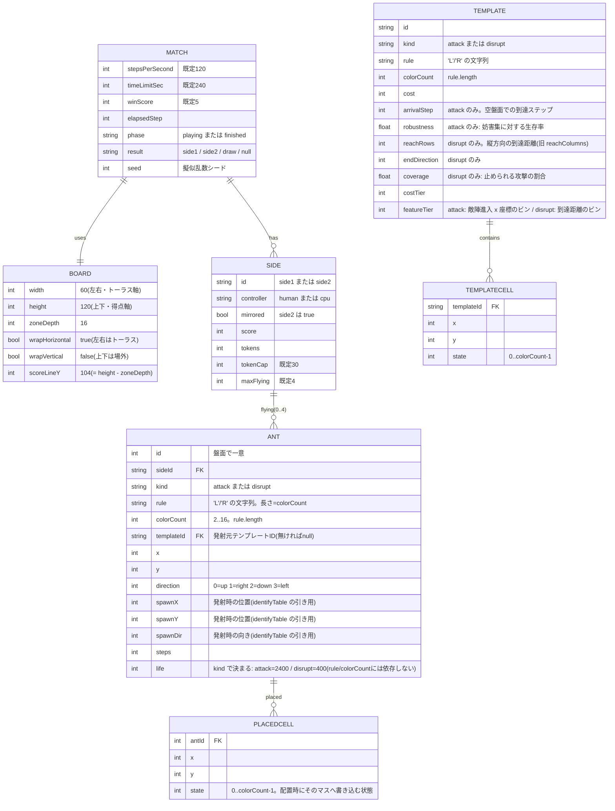

# データモデル

背景は [../README.md](../README.md)、機能・受け入れ条件は [spec.md](spec.md)、全体構成は [architecture.md](architecture.md)。

> v4(MAP-Elites 版)で盤面が90度回転し(60列×120行、攻撃軸が上下)、グローバル固定だった
> ルール(`RRL`)が廃止されて **rule/colorCount がアリ(テンプレート)ごと**になった。
> 数値は必ず [`src/config.js`](../src/config.js) の実際の値を参照すること。



| エンティティ | 主なフィールド | 補足 |
|---|---|---|
| Match(試合) | `stepsPerSecond`, `timeLimitSec`, `winScore`, `elapsedStep`, `phase`, `result`, `seed` | 先に `winScore` 到達で勝ち。240秒で得点比較、同点なら `draw` |
| Board(盤面) | `width`(60), `height`(120), `zoneDepth`(16), `wrapHorizontal`(true), `wrapVertical`(false), `scoreLineY`(104) | side1 の配置可能帯は `y=0..15`、side2 は `y=104..119`。左右はトーラス、上下端でアリ消滅/得点 |
| Side(陣営) | `id`, `controller`, `mirrored`, `score`, `tokens`, `tokenCap`, `maxFlying` | `tokens` は1秒ごとに+1(上限30)。アリ飛行中も蓄積。同時飛行は攻撃・妨害あわせて最大4匹 |
| Ant(アリ) | `id`, `sideId`, `kind`, `rule`, `colorCount`, `templateId`, `x`, `y`, `direction`, `spawnX`, `spawnY`, `spawnDir`, `steps`, `life` | 現在位置 `x` / `y` / `direction` は毎ステップ動く。発射位置 `spawnX` / `spawnY` / `spawnDir` は発射時に保存され、`identifyTable` で攻撃ID を引くときに使う。`rule` / `colorCount` は発射時に固定され消滅まで変わらない。`kind` で寿命が決まる(attack=2400 / disrupt=400。ルールの長さでは変わらない)。`steps >= life` で消滅 |
| PlacedCell(配置マス) | `antId`, `x`, `y`, `state` | **アリ単位**で持つ(陣営単位ではない)。そのアリの消滅時にクリーンアップ対象になる。`state` は `0 <= state < colorCount` |
| Template(テンプレート) | `id`, `kind`, `rule`, `colorCount`, `cost`, `arrivalStep` / `robustness`(攻撃)、`reachRows` / `endDirection` / `coverage`(妨害), `costTier`, `featureTier` | 攻撃用と妨害用で特徴軸が異なる。`robustness` / `coverage` は共進化生成の結果 |
| TemplateCell | `templateId`, `x`, `y`, `state` | 配置マスの座標と状態。アリの初期位置・向きは Template に `antX` / `antY` / `antDir` として持つ |

#### Ant の発射位置(`spawnX` / `spawnY` / `spawnDir`)

`identifyTable` で敵の攻撃を識別するにはアリの発射位置・向きが必要だが、Ant の現在位置 `x` / `y` / `direction` は毎ステップ移動するため識別に使えない。アリは発射したステップ内で既に1歩進んでいるため、観測できる時点で発射位置とは異なる値になっているためである。

代わりに、発射時に `spawnX` / `spawnY` / `spawnDir` として発射した陣営自身のローカル座標での発射位置を保存し、これを `identifyTable["\${spawnX},\${spawnY},\${spawnDir}"]` で引く(`src/engine.js` の `fire()`)。

## 盤面の内部表現

```js
board           = new Uint8Array(W * H);   // セルの状態。0(白)〜MAX_COLORS-1(15)まで取りうる
lastToucher     = new Int16Array(W * H);   // 最後にそのマスを踏んだアリの id。-1 = 誰も踏んでいない
lastToucherSide = new Uint8Array(W * H);   // 最後にそのマスへ触れた陣営。0=未接触 / 1=side1 / 2=side2
```

セルはオブジェクト化しない。60×120 = 7,200セルなのでコピーも探索も安価。

`lastToucher` は `Int16Array`(最大32,767)。1試合の発射数は最大でも「毎秒+1 × 240秒 ÷ 最小コスト3」= 80発なので、id は溢れない。

`lastToucherSide` は描画専用の追加フィールド(v4)。UI がセルの色相(陣営: 藍/朱)を決めるのに使い、`lastToucher` によるクリーンアップ判定のロジック自体には影響しない。

### 異種ルールの衝突(共通ルール)

グローバル固定の `RULE` は廃止された。各アリは自分の `rule`(`'L'/'R'` の文字列)と `colorCount`(= `rule.length`, 2〜16)を持ち、盤面の生値(0..15)を**自分の色数で割った余り**として解釈する。回転は「踏んだ時点の状態」で決める(状態を進めた後の値ではない)。

```js
// src/engine.js の stepAnt() より
const s = board[j] % ant.colorCount;
ant.dir = ant.rule[s] === 'R' ? (ant.dir + 1) & 3 : (ant.dir + 3) & 3;
board[j] = (s + 1) % ant.colorCount;
```

例: 16色アリが残した状態13のセルに3色アリが入ると `13 % 3 = 1` として解釈し、そのアリの規則に従って `(1 + 1) % 3 = 2` に書き換える。**この状態空間の圧縮自体を、異なる弾どうしのゲーム上の干渉として扱う**という設計判断であり、バグではない。

### 発射時の書き込み

```js
// cellState(cell) は [x,y] を state=1、[x,y,state] を state=cell[2] とみなす(互換)
for (const cell of template.cells) {
  const [x, y] = cell;
  const j = idx(x, toGlobalY(sideIndex, y)); // x は変換しない(左右は共有トーラス軸)。y だけ陣営ごとに鏡像
  board[j] = cellState(cell);       // ← セルごとに指定された状態で上書き。既存の非白セルにも無条件上書き
  lastToucher[j] = antId;           // ← -1 ではなく自分の id で埋める
  lastToucherSide[j] = sideIndex + 1;
}
```

`TemplateCell` は `[x, y, state]` の3要素(旧: `[x, y]` の2要素で状態は常に1)。`state` は `0 <= state < rule.length` を満たす必要がある。`src/engine.js` は互換のため、2要素の `[x, y]` も引き続き `state = 1` として受け付ける。

### クリーンアップ

アリ `a` が消滅したとき、白(状態0)に戻すのは次の集合(挙動は v3 から不変)。

```
{ a.placedCells のうち lastToucher[i] が -1 または a.id のもの }
∪ { lastToucher[i] === a.id であるすべてのマス }
```

`lastToucher` を見ることで、**他のアリが後から踏んだマスは残す**。複数アリが干渉する試合では、単純な一括クリアだと他のアリの軌跡を壊してしまうため必須。クリーンアップ時は `lastToucherSide` も同時にリセットする。

> v2 の `Ant.flippedCells`(アリ側が集合を持つ方式)は廃止した。他のアリが上書きしたかどうかを判定できないため。

## 座標系

エンジンは **side1 のローカル座標**で動く。x(左右)は両陣営で共有するトーラス軸なので変換しない。y(上下)だけが陣営ごとに鏡像になる: `yGlobal = HEIGHT - 1 - yLocal`(`src/engine.js` の `toGlobalY` / `toLocalY`。自己逆変換なので式は同じ)。向きは **up ⇄ down** を入れ替える(`mirrorDir`)。left / right はそのまま。`Side.mirrored` でどちらかを保持する。

## 探索(MAP-Elites)の型

`src/search/genome.js` / `src/search/mutate.js` / `src/search/map-elites.js` が、テンプレート生成の元になる探索空間の型を定義する。いずれも `src/engine.js` を import しない純粋なデータ操作(オフライン生成専用)。

### Genome

```js
genome = {
  rule: 'LRLR...',      // 'L'/'R' のみからなる文字列。長さ = colorCount(2..16)
  antX: 0,               // 配置帯(0<=antX<WIDTH)内のアリの初期位置
  antY: 0,               // 配置帯(0<=antY<ZONE_DEPTH)内のアリの初期位置
  antDir: 0,              // 0|1|2|3
  cells: [{ x, y, state }, ...], // 1..MAX_CELLS(16)個。座標は重複しない
};
```

不変条件(`validateGenome` が検査する。**エンジンの `canFire`/`fire` はこれを検査しない**、探索専用のチェックであることに注意):

- `rule.length` は 2..16、`'L'/'R'` のみで構成される
- `cells.length` は 1..16(`MIN_TEMPLATE_CELLS`..`MAX_CELLS`)。座標 `(x,y)` は重複禁止、`0<=x<WIDTH`・`0<=y<ZONE_DEPTH`
- 各セルの `state` は `0 <= state < rule.length`
- `antX`/`antY` は配置帯の内側、`antDir` は 0..3

`genome.js` はほかに `createRandomGenome(rng)`(不変条件を満たすランダム生成)、`cloneGenome`(深いコピー)、`genomeKey`(重複検出用の決定論的文字列キー)、`toTemplateCells(g)`(`cells` を `templates.json` 用の `[x,y,state]` 3要素配列へ変換)、`costOfGenome(g, baseCost)`(= `baseCost + cells.length`。ルール長にはコストを課さない)を提供する。

`mutate.js` の `mutate(genome, rng)` は `MUTATION_COUNT_WEIGHTS`(`[0.7, 0.2, 0.1]` = 1回/2回/3回)に従って変異を連鎖適用する。オペレータは `bitFlip`(rule の1文字反転)、`ruleInsert`/`ruleDelete`(rule の伸縮。長さ変更後は全セルの `state` を新しい `colorCount` で剰余に丸める)、`cellAdd`/`cellDelete`/`cellMove`/`cellState`、`antXPlus`/`antXMinus`/`antYPlus`/`antYMinus`/`antDir`。`rule.length` が境界(`MIN_COLORS`/`MAX_COLORS`)や `cells.length` が境界(`MIN_TEMPLATE_CELLS`/`MAX_CELLS`)にあるときは、その方向の伸縮オペレータを候補から外す。

### MAP-Elites アーカイブ(汎用実装)

`map-elites.js` の `createArchive({ dims })` は `dims: [{ name, bins }, ...]` を受け取り、内部表現は疎な `Map`(キーは各次元のビン値を連結した文字列)を持つ。`tryInsert(archive, { genome, descriptor, quality, meta })` は空セルなら常に挿入、埋まっているセルは `quality` が厳密に大きいときだけ置換する。`runMapElites({ archive, evaluate, rng, iterations, initialBatch, onProgress })` が「初期バッチをランダム生成 → 反復ごとに親をサンプリングして変異・評価・挿入」というループ本体。`evaluate` が `descriptor` を返さない個体は挿入せずスキップする。

> ⚠️ `createArchive`/`tryInsert`/`runMapElites` を実際に呼び出すコードは、本稿執筆時点では `test/map-elites.test.js` にしかない。以下のアーカイブ次元定義(`src/config.js` の `ARCHIVE1`/`ARCHIVE2`)は**型として存在するが、生成パイプラインに配線されていない**(`scripts/generate-templates.mjs` はこれらを import していない。[architecture.md](architecture.md) 参照)。

`src/config.js` に定義されている記述子ビン:

| アーカイブ(用途) | 次元 | 実際の値(`src/config.js`) |
|---|---|---|
| 第1アーカイブ(ハイウェイ発見) | `direction` | `ARCHIVE1.directions` = 8方向(`N,NE,E,SE,S,SW,W,NW`) |
| | `speed` | `ARCHIVE1.speedBins` = 10(0.0..1.0 を10等分) |
| | `formationTime` | `ARCHIVE1.formationBins` = `[64,128,256,512,1024,2048,4096,SEARCH_LIFE(20000)]` の8段階(対数的な区切り) |
| 第2アーカイブ(ゲーム候補) | `entryPositionTier` | `ARCHIVE2.entryPositionBins` = 6(敵陣へ侵入した **x座標**のビン。旧仕様は y だったが、盤面回転に伴い x に変更) |
| | `robustnessTier` | `ARCHIVE2.robustnessBins` = `[0.5, 1.0]`(v4.1 で `[0.2,0.4,0.6,0.8,1.0]` から削減。実測で robustness の値はほぼ最上位ビンに張り付き軸として機能していなかったため、後述の `speedClassTier` を追加した分のセル数増加を相殺する目的で粗くした) |
| | `speedClassTier` | `ARCHIVE2.speedClassBins` = `[0.035, 0.047, 1.0]`(v4.1 で追加。ハイウェイ署名から実効的な縦方向速度 `v_y = |driftY| / period` を出し、境界値でビン分けする3段階。archive2Attack の記述子は `(entryPositionTier, robustnessTier, speedClassTier)` = 6×2×3 = 36セルになった) |
| 妨害アーカイブ | `reach` | `ARCHIVE2.reachBins` = 6(縦方向の到達距離。旧 `reachColumns` → `reachRows`) |

`ARCHIVE1_QUALITY`(`stability`/`verticality`/`usability`/`formationPenalty`、いずれも重み1.0)は quality(挿入時の優劣比較に使うスカラー)の配分であり、記述子の次元ではない。

> ⚠️ **本稿がここで説明できるのは `src/config.js` にある値まで**。作業指示にある「第1アーカイブに `cost` 次元」「第2アーカイブに `costTier` 次元」は `ARCHIVE1`/`ARCHIVE2` のどちらにも対応する項目が無く、実装からは確認できなかった(cost はコストの小さい値域(6..21等)をそのまま tier として使う可能性はあるが、それを裏付けるコードが見つからなかった)。妨害アーカイブが `ARCHIVE2` オブジェクトの `reachBins` を間借りしている(独立した第3のアーカイブ設定オブジェクトが無い)点も、config.js の実際の構造として明記しておく。
>
> ⚠️ **`entryPositionTier`(x座標)を生成するコードも未確認。** `src/engine.js` の `simulateSolo()` は戻り値に `entryY`(得点時の `ant.y`)という**y座標**のフィールドしか持たない。x座標ベースの進入位置記述子は作業指示(本タスクの発注者からの指示)に基づく記載であり、`docs/spec.md`(441行目時点)は「敵陣への進入位置(**y座標帯**)」のままで、本書の記述と食い違っている。盤面が90度回転した以上 x 座標を使うのが整合的だが、この食い違いは `docs/spec.md` 側で解消が必要(本エージェントは `docs/spec.md` を編集する権限が無い)。

### ハイウェイ検出

検出ロジックは **`src/search/highway-detector.js`** にある(独立ファイルとして存在する)。ハイウェイ判定は2段構え(docs/spec.md 第8章「`highway.detected` を単一の boolean にしない」の決定に基づく。**軌跡の周期性はハイウェイの十分条件ではない**——位置と向きが周期的でも、周囲のセル状態が同じ構造を再生産しているとは限らないため):

1. **高速フィルタ = `detectHighwayFromPath(path, options)`**: 軌跡(位置+向き)だけを見る安価な周期性検出。`{ period, driftX, driftY, formationStep, verifiedCycles, speed }` を返す(見つからなければ `null`)。MAP-Elites が数百万 genome を評価するため、全候補にこれだけを適用する。
2. **厳密確認 = `verifyHighwayStrict(genome, candidate, options)`**: アリ座標を原点とした近傍セルの正規化 fingerprint が、確認済み窓のさらに先(`formationStep + verifiedCycles*period` 以降)で `HIGHWAY_MIN_CYCLES` 周期分一致することを、盤面込みで再シミュレーションして確認する高コストな検証。`true`/`false` を返す。高速フィルタで採用された候補にだけ適用する。

`src/search/evaluate-projectile.js` の `evaluateProjectile(genome, options)` がこの2段を `highway` オブジェクトの2つの boolean フィールドに落とし込む:

```ts
highway: {
  trajectoryPeriodic: boolean,   // detectHighwayFromPath(高速フィルタ)を通ったか
  fingerprintVerified: boolean,  // verifyHighwayStrict(厳密確認)を通ったか。
                                  // 既定では実行しない(常に false)。options.strict===true
                                  // のときだけ verifyHighwayStrict を実行して埋める
  period: number | null,
  driftX: number | null,
  driftY: number | null,
  verifiedCycles: number | null,
  formationStep: number | null,
  speed: number | null,
}
```

**使い分けは固定**(タスク仕様。混同すると高速フィルタの近似が最終選抜まで素通りしてしまう):

| 場面 | 使う値 |
|---|---|
| MAP-Elites 探索中(`scripts/generate-templates.mjs` のアーカイブ挿入・記述子計算・quality) | `trajectoryPeriodic` |
| 最終テンプレート選抜(9×9、`scripts/generate-templates.mjs` の候補プールから 9×9 を選ぶ直前のゲート) | `fingerprintVerified`(`evaluateProjectile(genome, {strict:true})` で再評価してから絞り込む) |

`src/config.js` の `HIGHWAY_MIN_CYCLES`(5)・`HIGHWAY_MAX_PERIOD`(2000)は `detectHighwayFromPath`/`verifyHighwayStrict` の既定パラメータとして実際に参照されている。

### data/search-archive.json

MAP-Elites 探索アーカイブのデバッグ・再現性確保用ダンプ。`map-elites.js` の `toJSON`/`fromJSON` がシリアライズ形式を提供する(`{ dims, cells: [[key, individual], ...] }`)。**ブラウザのゲームはこのファイルを読み込まない**(実行時が読むのは `data/templates.json` と `data/policy.json` のみ)。本稿執筆時点で `data/search-archive.json` はまだ生成されていない(`data/` には `templates.json` と `policy.json` のみ存在する)。

## data/templates.json

```json
{
  "generatedAt": "2026-08-06T00:00:00Z",
  "config": { "width": 60, "height": 120, "zoneDepth": 16,
              "minColors": 2, "maxColors": 16,
              "searchLife": 20000, "gameProjectileLife": 2400,
              "attackCost": 5, "attackLife": 2400,
              "disruptCost": 3, "disruptLife": 400, "maxCells": 16 },
  "attack": [
    {
      "id": "A1",
      "rule": "RLLRRLR",
      "colorCount": 7,
      "cells": [[12, 4, 3], [13, 4, 6]],
      "antX": 12, "antY": 5, "antDir": 2,
      "cost": 8,
      "arrivalStep": 1743,
      "robustness": 0.990,
      "costTier": 8,
      "featureTier": 3,
      "highway": { "trajectoryPeriodic": true, "fingerprintVerified": true, "formationStep": 418, "period": 26, "driftX": 0, "driftY": 2, "speed": 0.076923, "verifiedCycles": 5 }
    }
  ],
  "disrupt": [
    {
      "id": "D5",
      "rule": "RLLR",
      "colorCount": 4,
      "cells": [[6, 10, 1], [6, 11, 2]],
      "antX": 5, "antY": 11, "antDir": 1,
      "cost": 5,
      "reachRows": 20,
      "endDirection": 1,
      "coverage": 0.12,
      "costTier": 5,
      "featureTier": 2
    }
  ]
}
```

座標・向きはすべて **side1 ローカル座標**。side2 が使うときにミラーリング変換をかける。

> `gameProjectileLife` は `attackLife` と同じ値(2,400)のエイリアス(`src/config.js` の `ATTACK_LIFE` コメント「§7 の GAME_PROJECTILE_LIFE」を参照)。探索(ハイウェイ発見用の `SEARCH_LIFE`)とゲーム内寿命(`gameProjectileLife`=`attackLife`)を区別するために2つの名前を持つ想定。

> ⚠️ 上の2件は**形式を示す例**であり、実在の生成結果ではない。値の整合は生成スクリプトが保証する想定だが、本稿執筆時点で**リポジトリにコミットされている `data/templates.json` は旧スキーマ(v3.1)のまま**である: `config.width=120`, `config.height=60`, `config.rule="RRL"` で、`attack`/`disrupt` の各要素に `rule`/`colorCount`/`highway` フィールドは無い(`cells` も2要素の `[x,y]`)。新スキーマへの移行はテンプレート再生成([architecture.md](architecture.md))を待つ。

`robustness`(攻撃) = 「同梱の妨害テンプレート集 × 発射タイミング」の総当たりのうち、**止められなかった割合**。1.0 に近いほど強い。生成時に **1.0 未満であること**を保証する(1.0 = カウンター無し = 勝ち確定になるため)。

`coverage`(妨害) = 同梱の攻撃テンプレート集のうち、**その妨害が止められる割合**。

| 種類 | 特徴軸1 | 特徴軸2 |
|---|---|---|
| 攻撃 (`attack`) | `costTier` = cost の値(6..21程度の段階) | `featureTier` = **敵陣への進入位置(x座標)のビン**(0..5 の6段階。旧仕様は y 座標だったが盤面回転に伴い x に変更) |
| 妨害 (`disrupt`) | `costTier` = cost の値(4..19程度の段階) | `featureTier` = 縦方向の到達距離(`reachRows`)のビン(0..5 の6段階) × 到達時の向き |

> ⚠️ 攻撃の特徴軸に**到達時間は使わない**。実測(v3.1)では得点できる攻撃の到達時間がすべて 13.3〜15.4秒 に収まり、差がつかなかった(ハイウェイの速度が一定なので当然)。代わりに**敵陣への進入位置**を使う。どの妨害が届くかを決めるので実質的な意味がある。

## 事前計算テーブル(`data/templates.json` に同梱)

9種ずつしか無いので、全ペアの勝敗を事前に総当たりで計算して持てる。CPU と UI の両方が参照する。

```json
{
  "identifyTable": { "12,5,2": "A1", "3,50,0": "A2" },
  "counterTable": {
    "A1": [ { "disruptId": "D4", "fireAtStep": 600, "successRate": 1.0 },
            { "disruptId": "D5", "fireAtStep": 450, "successRate": 1.0 },
            { "disruptId": "D3", "fireAtStep": 900, "successRate": 0.1 } ]
  },
  "escortTable": {
    "A1": { "D4": [ { "escortId": "D2", "fireAtStep": 300 } ],
            "D5": [ { "escortId": "D7", "fireAtStep": 520 } ] }
  }
}
```

| テーブル | キー | 値 |
|---|---|---|
| `identifyTable` | `"antX,antY,antDir"`(発射位置・向き。side1ローカル座標) | 攻撃ID。**9種は発射位置・向きがすべて異なる**ので1ステップで一意に決まる(選抜基準の必須項目) |
| `counterTable` | 攻撃ID | その攻撃を止められる `{妨害ID, 発射ステップ, 成功率}` の一覧 |
| `escortTable` | 攻撃ID → 迎撃妨害ID | その迎撃を無効化できる `{護衛妨害ID, 発射ステップ}` の一覧 |

`successRate` は「その妨害を撃ったとき、記録した発射ステップの前後で止められる割合」。1.0 に近いほどタイミングがシビアでない。

> **`fireAtStep` は「止めたい攻撃アリが発射されたステップ」からの相対ステップ**(試合の絶対ステップではない)。生成時の候補は `[0, 150, 300, 450, 600, 750, 900, 1050, 1200, 1350]` の10通り(`src/config.js` の `FIRE_TIMINGS`)。CPU は敵の攻撃を識別したステップを起点に `敵の発射ステップ + fireAtStep` で撃つ。
>
> `escortTable` の `fireAtStep` も同じく「**自分の**攻撃アリが発射されたステップ」からの相対。

## data/policy.json

```json
{
  "trainedAt": "2026-08-06T00:00:00Z",
  "method": "CEM",
  "generations": 40,
  "matches": 96000,
  "winRateVsRandom": 0.0,
  "policy": {
    "fireThreshold": 8,
    "reserveTokens": 6,
    "defendBias": 0.7,
    "escortBias": 0.5,
    "attackPref": [1.0, 0.8, 1.2, 0.6, 1.1, 0.9, 1.3, 0.7, 1.0]
  }
}
```

| フィールド | 意味 |
|---|---|
| `fireThreshold` | このトークン数以上でのみ発射を検討する |
| `reserveTokens` | 迎撃用に温存するトークン量。これを下回る攻撃はしない |
| `defendBias` | 敵の攻撃が飛来中に、攻撃ではなく迎撃を選ぶ確率 |
| `escortBias` | 自分の攻撃に敵の迎撃が来たとき、護衛を撃つ確率 |
| `attackPref[9]` | 攻撃テンプレート9種(`TEMPLATE_COUNT_ATTACK`)の選好重み(softmaxで選択)。相手の防御傾向への適応がここに現れる |
| `winRateVsRandom` | 学習の効果を示す記録値。再学習したら更新する |

学習は CEM法(交差エントロピー法)による自己対戦。パラメータは13個。実測(v3.1) 362試合/秒 で、集団60 × 各40試合 × 40世代 = **約4分**。

> ⚠️ 上の値は**形式を示す例**であり実在の学習結果ではない。`node scripts/train-policy.mjs` を実行して実際の値で上書きすること。
>
> `data/*.json` は手で編集しない。ロジックを直したらスクリプトを再実行する([../AGENTS.md](../AGENTS.md) の Do NOT)。
